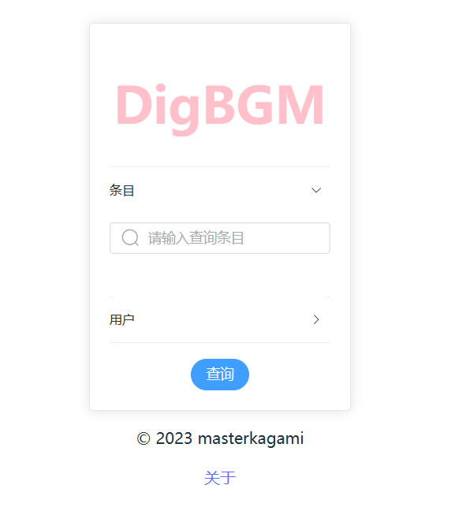

## DigBgm

 欢迎来到DigBgm--一个Bangumi数据检索工具！这个网站使用 Bangumi 的 API 实现数据检索。

<a href="http://digbgm.masterkagami.com/" rel="nofollow">演示地址Demo</a>

 前端使用 Vue3 和 Element Plus 进行构建，让你在使用该工具的同时享受良好的用户体验。
    后端使用golang的GIN框架，简单尝试中，本仓库只提交前端代码 

 目前正在严峻开发中，兴趣项目<s>（精力有限）</s> 

 你可以访问它的 GitHub 仓库地址：<a href="https://github.com/viogami/vite_DigBgm" target="_blank">DigBgm_vite</a> 

## 首页面预览

## 前言
初次尝试web开发，兴趣使然，事务繁多，这个项目的开发很是缓慢的

使用**vue3**，目前我希望可以通过自助调用bangumi的api完成一个全自动的数据采集并执行算法。

后端通过[bangumi API][1]调用。

该项目完全个人做全栈开发，不讲究界面设计了，css太困难。完全新手项目，我写了大量注释，每个文件和功能我也会具体介绍，也可以作为简单的vue3上手材料。

## 功能详解
### 首页(Home.vue)
- 页头导航，用props实现不同页面时，导航的显示位置
- 侧边栏收放和页面响应式设计(用`el-col`，自带响应式)
- 文档显示功能
  - 使用markdown-it，更多依赖见`package.json`文件
  - 文档使用动态路由，详见`router/index.js`文件
  - `document.vue`是文章主组件，负责显示页面，文章列表，文章点击路由，该页面定义文章列表的菜单样式(目录层次)。
 `docPage.vue`是负责调用markdown工具进行编译，返回编译后的数据。`docCat.vue`是文章的目录文件也是路由进行匹配的文件，负责导入文章并实现文章路由。
  最后再定义一个`markdown.vue`组件执行编译markdown文本，这个组件是仿用了别人的项目。
- 时间线，关于页面的简单路由，以及404页面的路由

### 用户页(UserPage.vue)
- 通过搜索用户名进入用户页(以后可能变动)
- 显示用户的基本信息，创建一个卡片，显示用户的收藏
- 用pinia的一个store存放所有用户信息(userProfile.js),在其中定义增删查改。

### 搜索(search.vue)
- 用户查询
- 条目搜索(目前只返回了数量)

### 调用api
- 创建一个axios.js文件
- 新建user.js等文件，用处定义调用api的函数

[1]: https://bangumi.github.io/api/#/