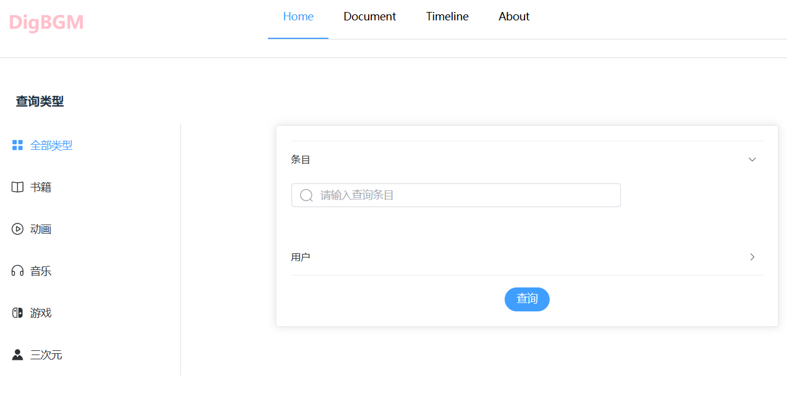

## DigBgm

 欢迎来到DigBgm--一个Bangumi数据检索工具！这个网站使用 Bangumi 的 API 实现数据检索。

 前端使用 Vite 和 Element Plus 进行构建，让你在使用该工具的同时享受良好的用户体验。
    后端使用golang的GIN框架，简单尝试中，本仓库只提交前端代码 

 目前正在严峻开发中，兴趣项目<s>（精力有限）</s> 

 你可以访问它的 GitHub 仓库地址：<a href="https://github.com/viogami/vite_DigBgm" target="_blank">DigBgm_vite</a> 

## 首页面预览

